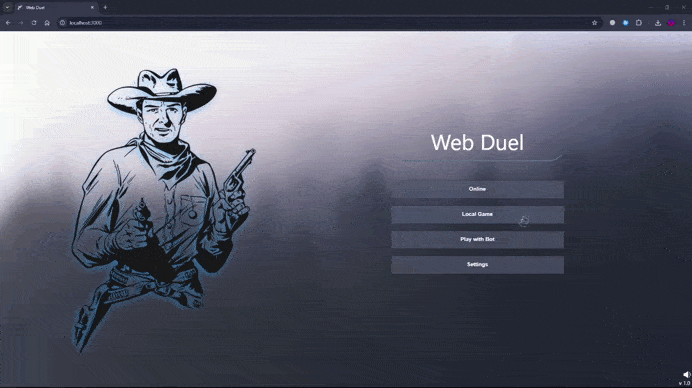
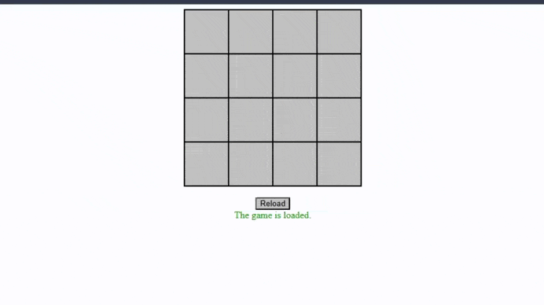
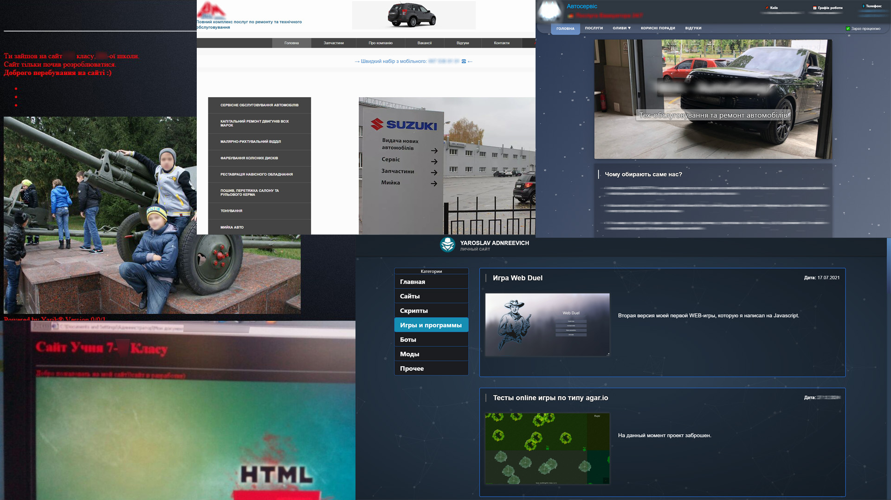

# A collection of my old web projects

- ### [Agar.io clone (client-server)](./agario-clone/) (2022)

    

- ### [Web RPG (client-server)](./web-rpg/) (2021)

    

- ### [WebDuel (client-server)](https://github.com/yaroslav-andriyovich/WebDuel) (2020)

    

- ### [Automatiozation](./automatization/) (scripts/bots) (2018-2020)

    

- ### [Memory game](./memory-game/) (2018)

    

- ### Websites (2015-2018)

Since 7th grade in school, I started learning website development using HTML/CSS/JS, and after a bit of PHP + SQL. During this time I created several simple business card sites, one of which I still maintain.

    

