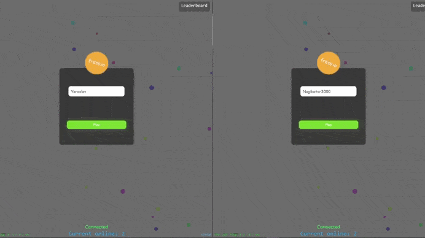

# Agar.io clone (client-server)

An attempt to create a clone of the browser-based online game [Agar.io](https://agar.io/) using [TypeScript](https://www.typescriptlang.org/), [Socket.io](https://socket.io/) and [PointJS](https://pointjs.ru/).

### Implemented 
- multiplayer; 
- automatic room creation and connection;
- nickname selection; 
- rating table; 
- moving; 
- food spawn and selection; 
- increasing player radius;
- game score;
- spawn thorns;
- devouring thorns and other players;
- separating food from the player and devouring it;
- custom data types for interaction with the server and data spoofing elimination.

     
    

[Open Server](https://ospanel.io/) is used for the local network.

The [node_server.ts](./server/node_server.ts) file is needed to start the server.

To open a web page, the [index.html](./site/index.html) file is used.