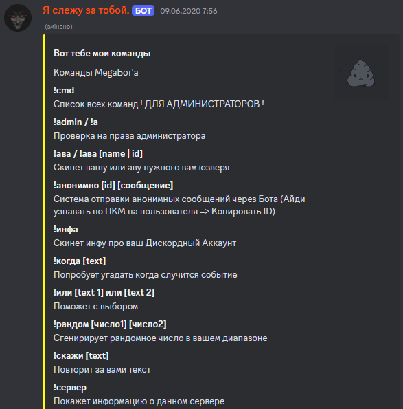

# Discord bot

The discord bot was written for fun. It had several versions, including parsing information from websites, local games, constantly changing the rainbow color of the role and playing sounds, but some of the code was lost and some of it stopped working.

This code is from memory. If writing your own bot, it's better to use fresh libraries and from scratch.

### Features:
- informs about a new or left member of the server
- realizes if he's the administrator himself
- checks whether the sender of the message is an administrator
- can be banned for advertising another discord server
- has commands that start with the prefix “!”
- can clear the chat from N messages
- can remove a member's role
- can send a member their avatar
- can report information about the server or a member's account
- can send an anonymous message
- can help with choices when you have two things to choose from
- can count the length of the text sent to it
- can send a random number
- can select a random member of the server
- can send a text on its own behalf
- can predict the date of an event

    

_Perhaps someday I'll write a new bot)...._