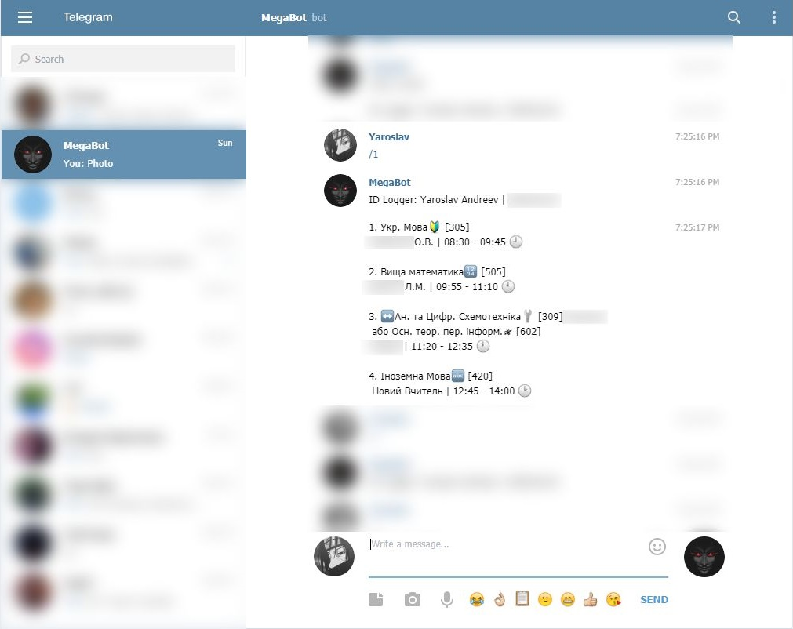

# Telegram bot from college

This bot was hastily written. It automatically sent the schedule of lessons for each day and also kept a list of those who were on duty today. The core worked in **Node.JS**, but it also accessed an addon written in **PHP**, because some of the data was dynamic and it was easier for me to change it on the site. Both files were run on a rented VPS.

This code is from memory. If writing your own bot, it's better to use fresh libraries and from scratch.

    

