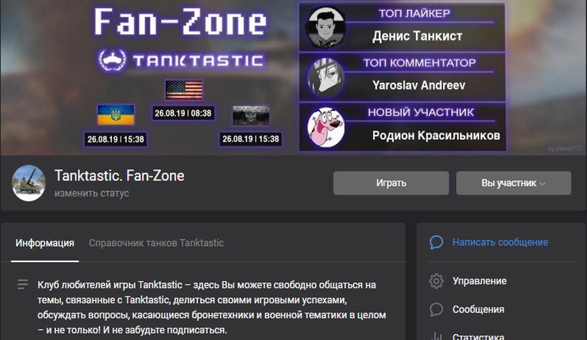
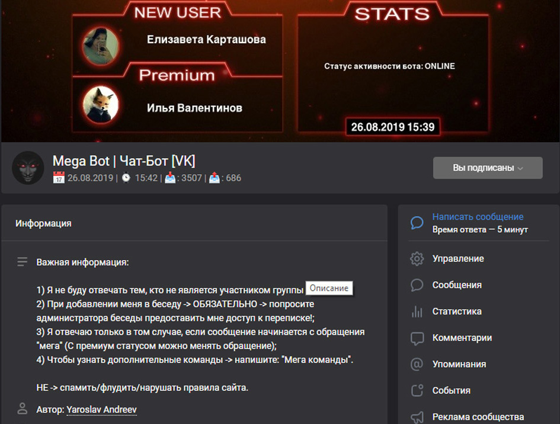

# Live cover for the community (VK)

I once wrote scripts to constantly update the cover for three communities. Using PHP scripts, I took a background image, overlaid text and other images on top of it, and then using API the finished image was uploaded as a new cover for the community once in N time. The update was done on the VPS using [cron-tasks](https://en.wikipedia.org/wiki/Cron).

The **main function** of such covers was to **display new members**, as well as **top-likers** and **top-commenters** for the last few posts. For one of the covers, there was a link to my [mega bot](../vk-mega-bot/), which could be used to change the text that was displayed on the cover.

### Example 1 (TT-Fan-Club)

    

### Example 2 (TT-Fan-Zone)

    

### Example 3 (MegaBot)

    

