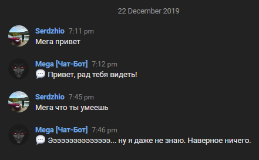

# Mega bot (chat-bot for VK)

I was inspired by the idea of [drfailov](https://github.com/drfailov), who a long time ago created his own program that allowed you to control a bot for VK using your phone. Since his app limited the bot's functionality, I wanted to write my own bot, which would be able to do more and would run on a dedicated server. This is a **new version** of the bot written in **Node.JS** using the [**vk-io** API](https://github.com/negezor/vk-io). The previous version was originally [written and operated in **PHP**](./old-php-version). (O_o)

[MegaVK.js](./MegaVK.js) - code that was executed for [personal page](https://vk.com/id_megabot) of the bot (yes, the bot had its own personal page created). Here it was decided to leave only the function of automatic checking and accepting friend requests on the bot's personal page.

[MegaGroup.js](./MegaGroup.js) - code that was executed for [community](https://vk.com/megabot_club). At one point, vk made it difficult to read and send private messages from a personal page via the API, so it was decided to move all bot functionality to private messages on behalf of the community.

### Main feature

At that time, neural networks were not yet popular, and trying to simulate real communication was the main feature of the bot. Using [question/answer database](./answer_database2.txt), the bot would process an incoming message, and if it wasn't a command, it would answer it by finding the biggest match from the database. It was not stable, but sometimes it hit very hard)

    

Especially it was hilarious to try to troll the bot, and most often it outplayed the opponent :D

    
    

### Commands:

👍 [Rate anything]
-> Mega check out my avatar.

👨‍💼 [Wisdom]
-> Mega wisdom (I'll tell good wisdom)

🔔 [Fact]
-> Mega fact (I'll tell you an interesting fact)

🏖 [Photo]
-> Mega kitty photo

🦅 [Heads or Tails].
-> Mega coin

🎲 [Random Numbers]
-> Mega random 0 100

⌚ [Exact time]
-> Mega time

👤 [Your Page Details]
-> Mega who am I? [give broad information about the page]

📅 [Find out the date of creation of your/any vk page]
-> Mega creatEd vk.com/id#########

🗣 [Say your text].
-> Mega say hello

🔀 [I'll write your RUSSIAN text in transliteration]
-> Mega translit Afigenna.

🔁 [Write your text backwards] [“znp”]
-> Mega znp Text that needs to be flipped.

⚖ [Help you choose between two things]
-> Mega ios or android?

☄ [Predicting the date of an event]
-> Mega when will I wise up?

💯 [Event Probability]
-> Mega info tomorrow is the end of the world

☁ [Weather for your city/country]
-> Mega weather Kiev

    

