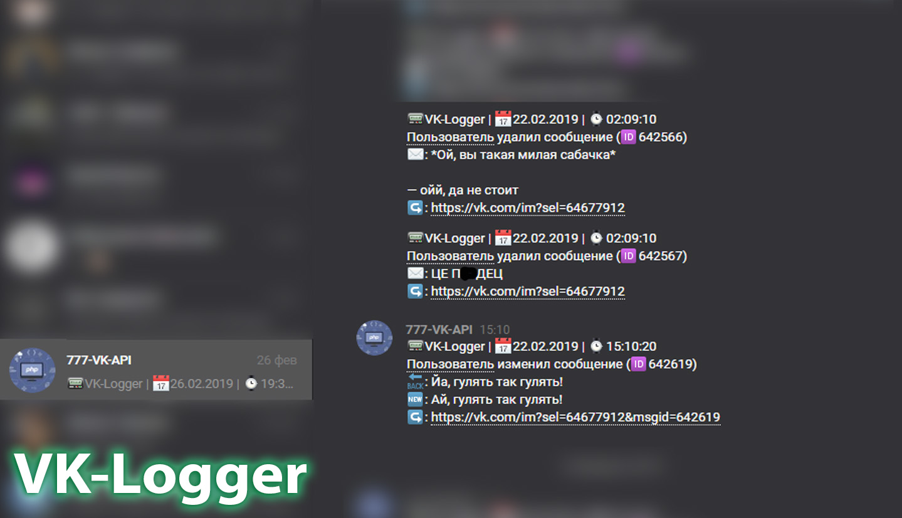

# VK page script

Using [PHP](https://www.php.net/) and [VK-API](https://dev.vk.com/ru/method), I created a script that was hosted on my own VPS, and could be updated in different parts using [cron-tasks](https://en.wikipedia.org/wiki/Cron).

By updating the online part of the script once every 2 minutes, the status “online” was always on my page, even if I was asleep and not online.

    

Also, by updating the status part of the script, there was a dynamic status on my page where the script determined if I myself was online and from which device, and updated the date and time.

    

And now for the most interesting part, **VK-Logger**. I took an idea from Alex Monolit, and implemented my own logger of private messages. The script scanned N dialogs and N2 messages each, then saved all the data to a .json file. Then, on the next scans, the script compared the sequence of messages, and their edit labels. In case some message was deleted or edited, the script sent a log with the data in a private message.

    

